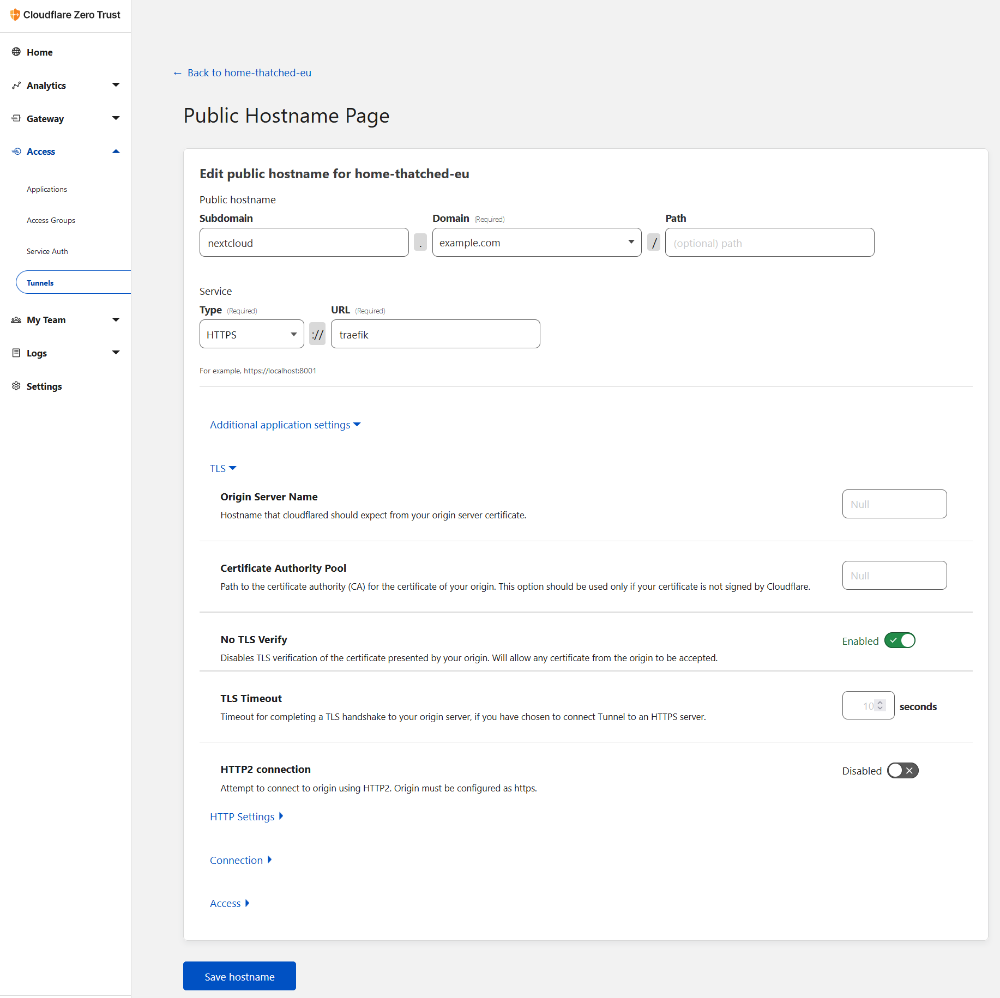

# cloudflared

[Cloudflare Tunnels](https://developers.cloudflare.com/cloudflare-one/connections/connect-apps/) are a secure way to make your services publicly available.

Making your homeserver accessible for everyone is an advanced feature and should only be done if you know what you are doing. Consider setting up a virtual machine dedicated for public services, seperate from your personal instance or pay a few dollars a month for a VPS at https://www.linode.com or https://www.digitalocean.com/

If you are the only person who needs access to your homeserver while not being at home, consider using tailscale instead.

1. Your domain has to be managed by cloudflare. You can add it via the [dashboard](https://dash.cloudflare.com).
2. In the left column go to 'Traffic' -> 'Cloudflare Tunnels' -> 'Launch Zero Trust Dashboard'
3. Once you are in the Zero Trust Dashboard go to 'Access' -> 'Tunnels' -> 'Create a Tunnel'
4. Give it a name you like, copy the token and add it to the .env file in this folder.
5. Start your tunnel with 'docker compose up -d'.
6. Once your Tunnel is created you can configure it. Go to 'Public Hostnames' and add a service you would like to publish.
7. Enter the subdomain like 'nextcloud' and select your Domain.
8. Under Type select 'HTTPS' and as URL 'traefik'.
9. Under 'Additional application settings' -> 'TLS' -> enable 'No TLS Verify'.
   1.  I do not understand why this step is neccessary but without it, it does not work. If you have a deeper understanding, please let me know.
10. Click 'Save hostname'
11. Now everyone can access your locally hosted service via the internet.
12. Add a hostname for every service you want to publish.

Hostnames you have added to the tunnel will be routed via cloudflare even when you are at home because cloudflare will change the DNS A-record to point to their servers. If you still want to access a published service directly without cloudflare as a man in the middle while being at home, you can setup a [split horizon DNS](https://en.wikipedia.org/wiki/Split-horizon_DNS) but this is a very advanced topic.
